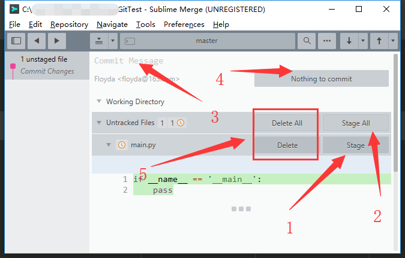
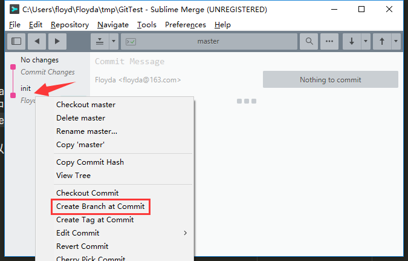
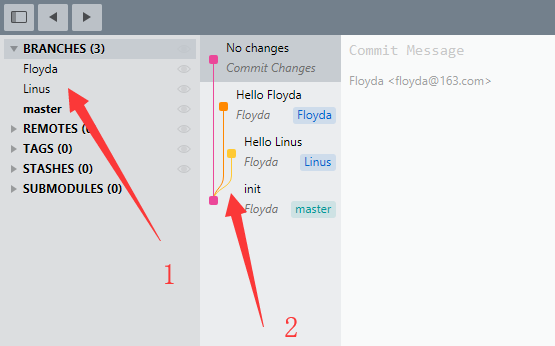
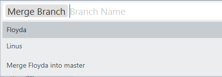
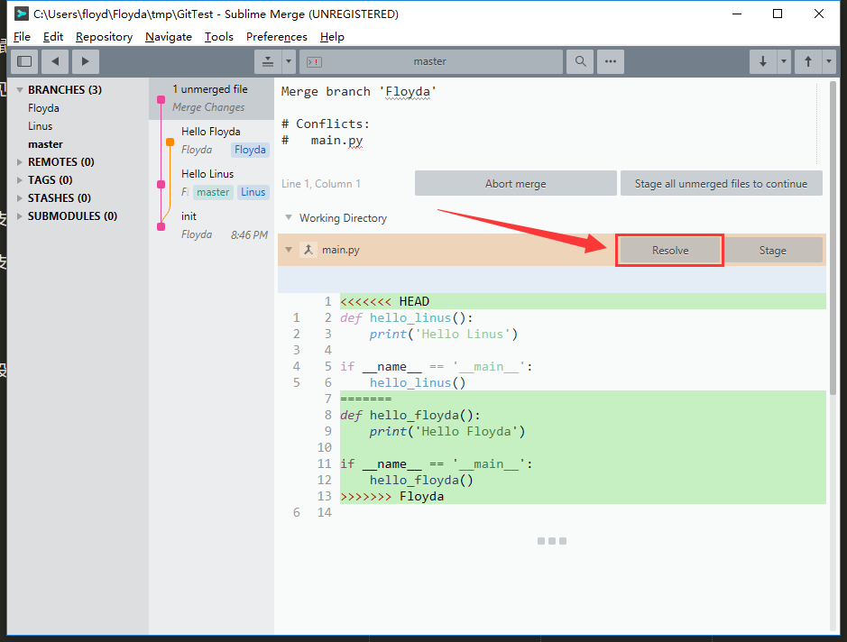
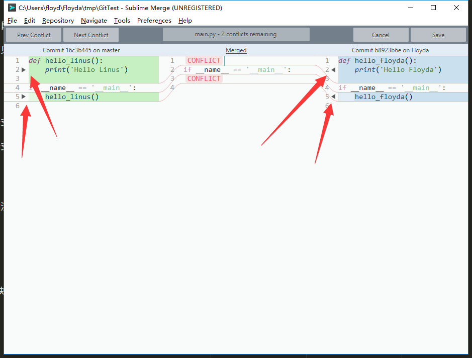
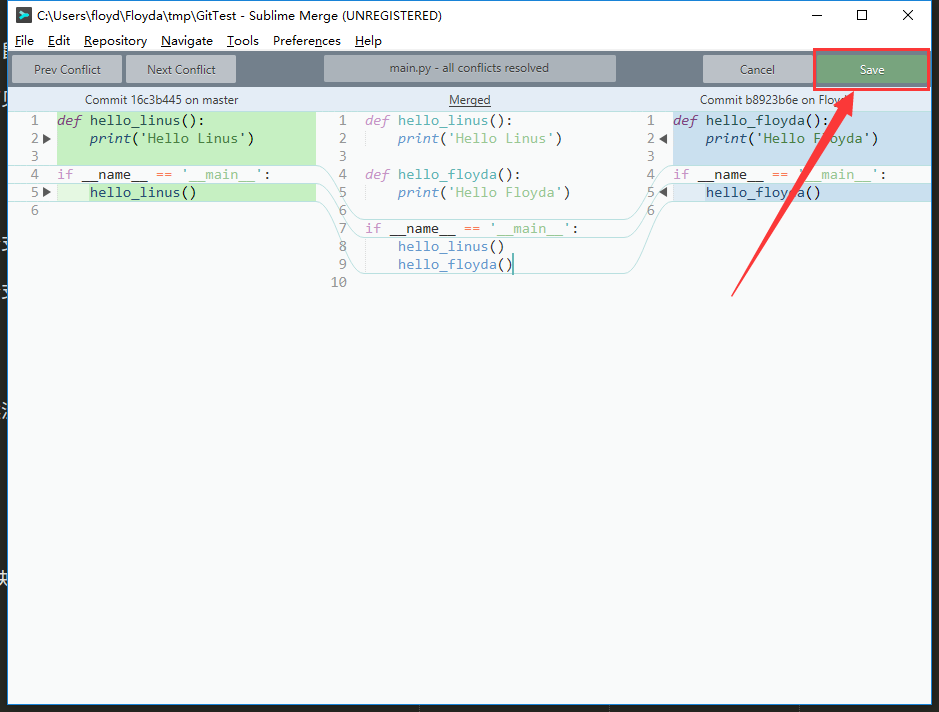
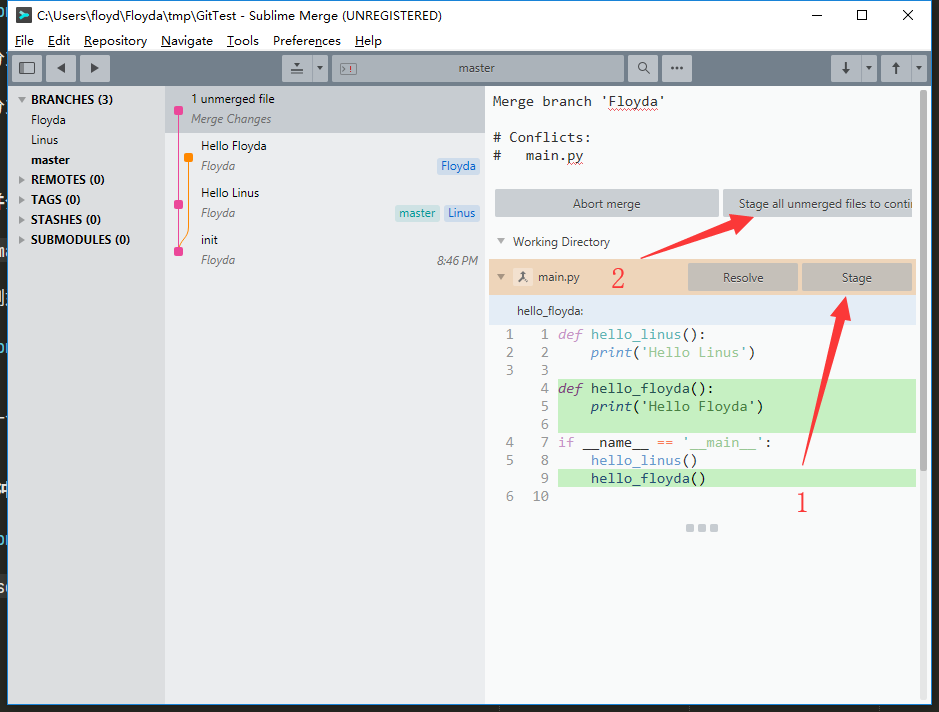

# 案列: 解决冲突
> 模拟一个冲突的情况   

- [初始化一个本地仓库](#1)  
- [Sublime Merge的第一次提交](#2)  
- [创建分支](#3)  
- [切换分支](#4)  
- [合并分支](#5)  
- [解决冲突](#6)  


### 1. 初始化一个本地仓库

```zsh
mkdir GitTest
cd GitTest
git init
touch main.py
subl main.py
```

`main.py`如下:

```Python
if __name__ == '__main__':
    pass
```


### 2. Sublime Merge的第一次提交



1. `Stage`: 将main.py这个文件加到stage(暂存区)中.    
2. `Stage All` 将所有文件加到stage中. 需要点击2次才能确认.    
3. 快捷键`ctrl + 1`到`Commit Message`填写提交信息.    
4. 提交. 将stage提交到本地仓库.    
5. 因为main.py是新建的文件, 所以可以用`Delete`删除文件(慎重!!!)    


### 3. 创建分支
> 快捷键`Ctrl + Shift + B`

创建2个分支: `Floyda`和`Linus`



或者右键选择`Create Branch at Commit`


### 4. 切换分支
> 快捷键`Ctrl + B`

分别切换到`Floyda`和`Linus`分支, 修改`main.py`

Branch Linus:

```Python
def hello_linus():
    print('Hello Linus')

if __name__ == '__main__':
    hello_linus()
```

Branch Floyda:

```Python
def hello_floyda():
    print('Hello Floyda')

if __name__ == '__main__':
    hello_floyda()
```

按上面的步骤添加提交代码, 结果如下图:



1. 3个分支可以用鼠标双击切换.    
2. 3个分支脉络可见, 非常清晰.    


### 5. 合并分支

切换回`master`分支, 快捷键`Ctrl + P`打开命令行界面, 输入`Merge Branch`.    
或者在侧边栏的分支上右键选择`Merger XXX into master`    




合并第一个的时候没有问题, 合并第二个分支的时候, 就会出现冲突了.


### 6. 解决冲突



点击`Resolve`解决冲突



可以点击这些黑色的箭头来选择合并的代码块, 快捷键是`Ctrl + Shift + [`和`Ctrl + Shift + ]`    
也可以`Ctrl + Enter`打开Sublime, 在编辑器中敲键盘修改.    



解决好冲突之后, 记得保存. 



然后继续上面的步骤: `Stage`->`Commit`
