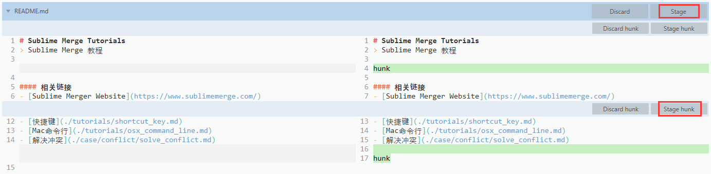
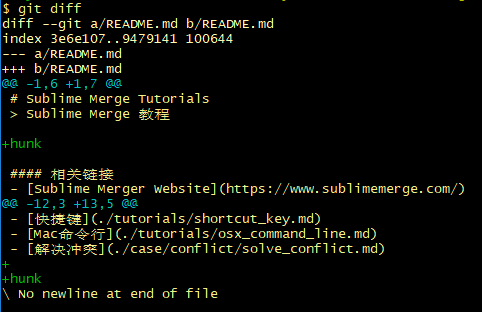
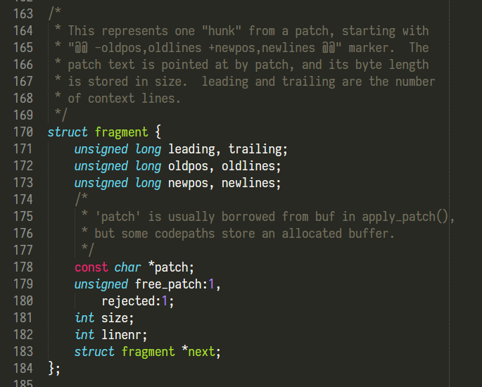

# Sublime Merge中的Hunk是什么意思


### Sublime Merge中的`Hunk`是什么意思


当我们在提交代码的时候:    
- `stage`是把整个文件的修改放到暂存区中.    
- `stage hunk`是把文件中某一部分代码块的修改放到暂存区中.    

**`hunk`的意思就是`有修改的代码块`**    
**So, 慎重起见, 我们在提交代码的时候, 以`hunk`为单位, 逐一添加.**    


### 在命令行中用`git diff`查看



> 可见`Sublime Merge`十分清晰明了且美观的把diff的结果展示给了我们.


### 在Git源码中查看

> ./git/apply.c    



```C
/*
 * This represents one "hunk" from a patch, starting with
 * "@@ -oldpos,oldlines +newpos,newlines @@" marker.  The
 * patch text is pointed at by patch, and its byte length
 * is stored in size.  leading and trailing are the number
 * of context lines.
 */
struct fragment {
    unsigned long leading, trailing;
    unsigned long oldpos, oldlines;
    unsigned long newpos, newlines;
    /*
     * 'patch' is usually borrowed from buf in apply_patch(),
     * but some codepaths store an allocated buffer.
     */
    const char *patch;
    unsigned free_patch:1,
        rejected:1;
    int size;
    int linenr;
    struct fragment *next;
};
```

