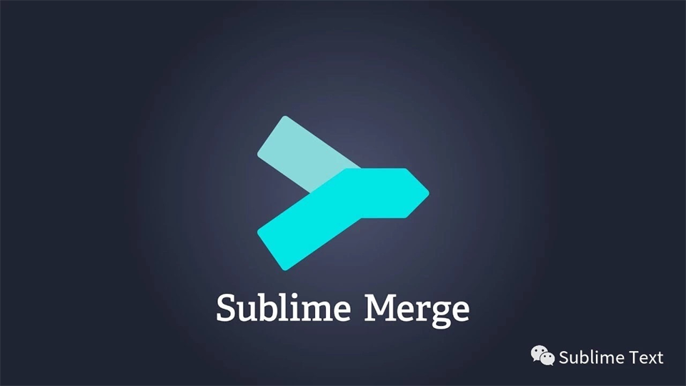

# Sublime Merge, 像Sublime那样使用Git

### 什么是Sublime Merge

Sublime Merge是Sublime Text的姐妹产品.    
都来自于Sublime HQ 家族.    
虽然名字带Merge, 感觉是一款合并工具.    
**但其本质是一个Git的客户端.** 

- Sublime Merge坚持了Sublime Text一贯的作风:    
    - 更轻量    
    - 更快捷    
    - 更美观    
    - 更注重细节

- 价钱也一如既往的贵, 99刀.    当然, 不购买也能正常的使用.     
    - 偶尔会弹出一个提示框    
    - 不能使用Merge Dark的主题    

### 特点
- 提交更快    
- 复审更好    
- 搜索更强    
- 合并更爽    

### 功能特性
- 集成合并工具    
- 强大的性能    
- 强大的Diff功能    
- 命令行面板和快捷键    
- 可扩展性    
- 集成命令行    
- 强大的搜索功能    
- 文件和代码块历史功能    
- 提供日间和夜间主题    
- 语法高亮    
- 真正的 Git：Sublime Merge 使用与 Git 相同的术语，并且不使用 Git 之外的任何描述    

> from: https://www.sublimetext.com/blog/articles/sublime-merge    
> It combines the UI engine of Sublime Text, with a from-scratch implementation of Git. The result is, to us at least, something pretty special.    
> **它结合了Sublime Text的UI引擎和Git的从头实现. 结果, 至少对我们来说, 是非常漂亮的特别的.**    

