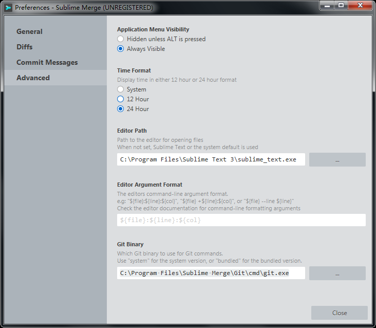

# Sublime Merge中使用钩子(hook)  

## git hook  
> 参考文章:  
> - [Git 钩子](https://git-scm.com/book/zh/v2/%E8%87%AA%E5%AE%9A%E4%B9%89-Git-Git-%E9%92%A9%E5%AD%90)  
> - [钩子：自定义你的工作流](https://github.com/geeeeeeeeek/git-recipes/wiki/5.4-Git-%E9%92%A9%E5%AD%90%EF%BC%9A%E8%87%AA%E5%AE%9A%E4%B9%89%E4%BD%A0%E7%9A%84%E5%B7%A5%E4%BD%9C%E6%B5%81)  

## Sublime Merge中使用钩子(hook)  
> 参考文章:  
> - [Commit hook not working on Windows](https://forum.sublimetext.com/t/commit-hook-not-working-on-windows/39552)  

## 在Sublime Merge中使用hook失效
  

如果hook中要执行一段很复杂的脚本, 有可能是失效的.  
我的解决方案是不用默认的`system`的git方案, 而是选用SM自带的.  
选择路径为`C:\Program Files\Sublime Merge\Git\cmd\git.exe`  
